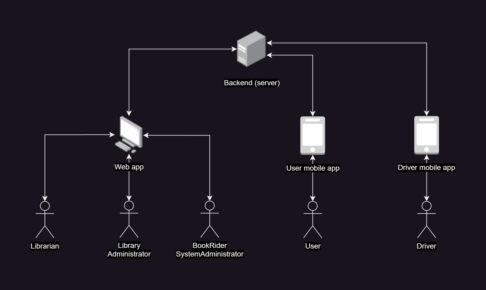
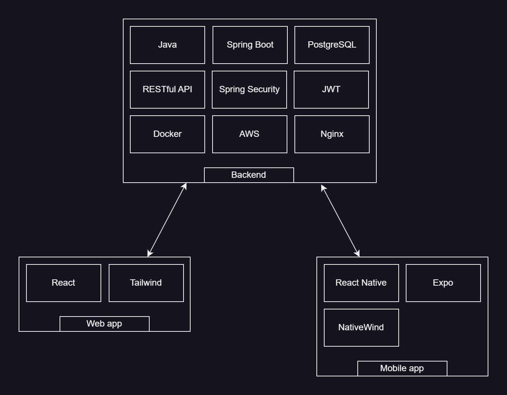

# BookRider
An Uber Eats-style on-demand delivery system for library books.

**Library book delivery platform** that allows users to **borrow books from libraries remotely** and have them delivered by our **on-demand, order-based drivers**. Users can **browse available books**, **compare delivery prices**, **place home delivery orders**, and **order book returns**. **Drivers** can **pick up** and **deliver the books** as needed.

## System Overview 🧩

The system is composed of four core components:

- 🖥️ **Backend**  
- 🌐 **Web App**  
- 📱 **User Mobile App**  
- 📱 **Driver Mobile App**  

---

---

## Tech Stack 🛠️

---

## Component Documentation 📄

For detailed documentation on each component, including setup instructions, architecture notes, and development guidelines, refer to the `README.md` file located in the corresponding directory:

- [`/backend`](./backend)
- [`/web_app`](./web_app)
- [`/user_mobile_app`](./user_mobile_app)
- [`/driver_mobile_app`](./driver_mobile_app)

