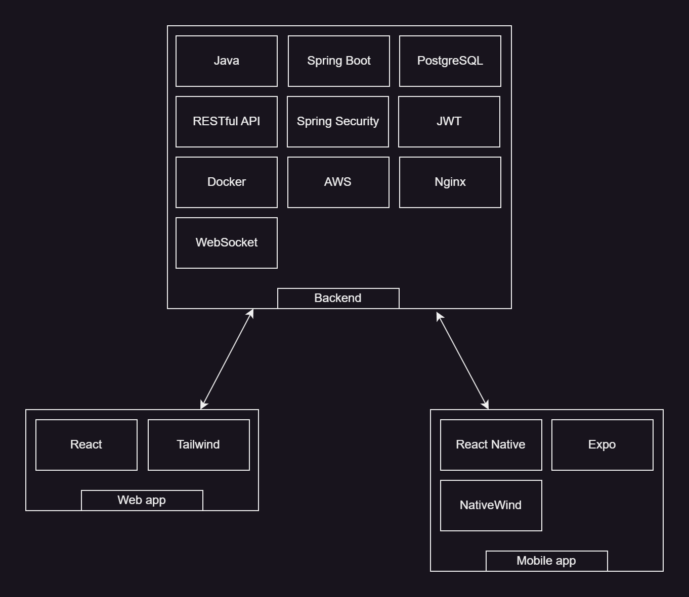

# BookRider - A library straight to your door.
An Uber Eats-style on-demand delivery system for library books.

**Library book delivery platform** that allows users to **borrow books from libraries remotely** and have them delivered by our **on-demand, order-based drivers**. Users can **browse available books**, **compare delivery prices**, **place home delivery orders**, and **order book returns**. **Drivers** can **pick up** and **deliver the books** as needed.

## 🌐 **System Overview**

The system is composed of four core components:

- 🖥️ **Backend**  
- 🌐 **Web App**  
- 📱 **User Mobile App**  
- 📱 **Driver Mobile App**  

---

---

## 🛠️ **Tech Stack**

---

## 🔄 **CI/CD Pipelines**

Our project includes two CI/CD pipelines:

- **Backend Deploy**
- **Web App Deploy**

These pipelines are triggered automatically when a pull request is merged.  
If changes are detected in the `/web-app` directory, the **Web App Deploy** pipeline runs.  
The web app is built in the **cloud using GitHub Actions**, and the build artifact is then deployed to our **AWS EC2 instance**.

Similarly, changes in the `/backend` directory trigger the **Backend Deploy** pipeline, which includes **unit** and **integration tests** using **GitHub Actions**.  
The backend is deployed only if all tests pass successfully.

## 📄 **Component Documentation**

For detailed documentation on each component, including setup instructions, architecture notes, and development guidelines, refer to the `README.md` file located in the corresponding directory:

- [`/backend`](./backend)
- [`/web_app`](./web_app)
- [`/user_mobile_app`](./user_mobile_app)
- [`/driver_mobile_app`](./driver_mobile_app)

