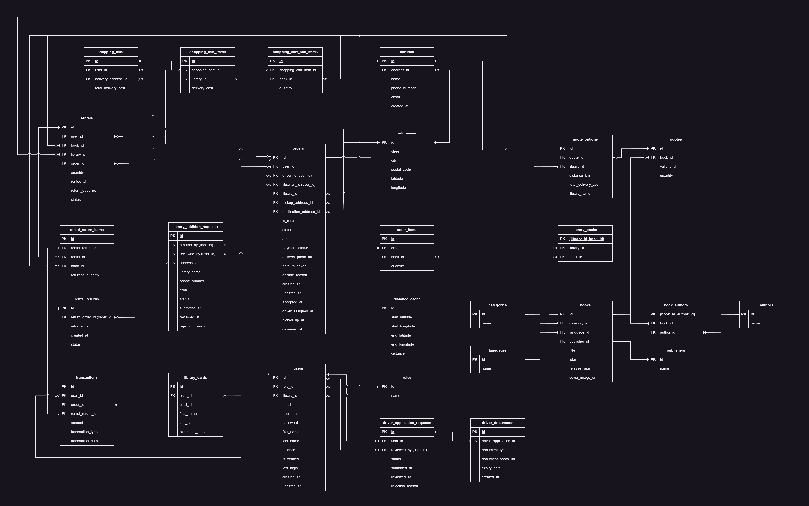

# Backend - v1.0.1

## Overview  
This is the **backend** for a **library book delivery platform**, allowing users to **browse available books from city libraries** and check which libraries have a specific book in stock, along with their delivery prices. Once a user selects a library, they can place an order to have the book delivered to their address.  

Deliveries are handled by **drivers**, who receive orders in real time through their mobile app, similar to how food delivery services operate. After borrowing a book, users can either **schedule a return for pickup** or **return it in person at the library**.  

Librarians play a key role in the process—they can **accept or decline orders** based on availability and operational capacity. They are also responsible for **verifying book returns**, whether they are brought back by a driver or returned in person by the user.  

The backend manages **user authentication, order processing, shopping cart management, checkout, and rental returns**, ensuring smooth coordination between **libraries, users, and drivers** while maintaining **security, efficiency, and reliability**.  

## 🌐 **Deployment Overview**
- **AWS EC2**: The backend runs inside a **Docker container** on an **EC2 instance**.
- **Nginx (SSL Proxy)**: Handles **SSL termination** and forwards requests to the backend.
- **Custom Domain**: Hosted on a **paid domain** for production-grade reliability.
- **PostgreSQL Database**: Hosted on **third-party infrastructure** outside AWS.
- **Dockerized Backend**: Ensures **consistent deployments** across environments.
- **API Documentation**: Available via **Swagger UI** (`/swagger-ui`).

## 🔥 **Tech Stack**
- **Java 17** + **Spring Boot 3.x** – RESTful API framework.
- **PostgreSQL** – Relational database.
- **Docker** – Containerized deployment.
- **Nginx** – Reverse proxy & SSL termination.
- **AWS EC2** – Cloud infrastructure.
- **Swagger** – API documentation.

## 🛡️ **Security Features**
- **JWT-based authentication** for secure access to the API.
- **Role-Based Access Control (RBAC)** for restricting access to resources based on user roles.
- **SSL Encryption** via Nginx to ensure secure communication between clients and the server.

## 🔄 **CI/CD Pipeline**
The backend CI/CD pipeline is fully automated using **GitHub Actions**. The pipeline is triggered automatically after closing a pull request to the **dev branch** in the **backend directory**. It follows these steps:

- **Unit and Integration Tests**: The pipeline runs the unit and integration tests on the GitHub servers using the JVM.
- **Deployment to EC2**: If the tests pass, the workflow connects to the **AWS EC2 instance** via **SSH**, pulls the latest changes from the remote GitHub repository, and updates the backend container with the new code.
- **Automatic Restart**: The updated container automatically restarts with the new code, ensuring the backend is continuously deployed and up-to-date.

## 🧑‍💻 **User Roles & Permissions**

The platform has several key roles, each with specific responsibilities and permissions. These roles are managed through **Role-Based Access Control (RBAC)** to ensure that users can only access the resources and actions relevant to their role.

### **System Administrator**
- Verifies **driver application requests**.
- Reviews and approves **library addition requests**.

### **Library Administrator**
- Creates **initial library addition requests** to add new libraries to the system.
- After a library is added, manages the library:
  - Add or remove other **librarians**.
  - Reset librarian passwords.

### **Librarian**
- Verifies **book returns** (both from drivers and users).
- Accepts or declines **user orders** based on book availability.
- Adds and manages **book availability** (whether a book is in the library or not).
- Adds new books to the system and assigns them to their library.
- Responsible for adding a **user's library card** to their account when they meet in person, enabling the user to place orders.

### **User**
- Browse available books across libraries.
- Place **book orders** for delivery (can only order if their library card is added by a **Librarian**).
- Create **rental return requests** for borrowed books.

### **Driver**
- Responsible for delivering **normal orders** (new orders placed by users) or **return orders** (books that users are returning).
- **Paid per order** based on the delivery, not hourly.

## 🔗 **External APIs**

### **FreeImage.host API**  
- This API is used to upload and store images within the platform. When drivers or librarians upload images, like delivery photos, or book covers, they're sent to **FreeImage.host** for storage. The API then provides a URL, which is saved in the database for easy access to the images on the platform.

### **OpenRoute Service API**  
- **Geocoding** is used to convert user-submitted addresses into geographic coordinates (latitude and longitude). This step is essential for later calculating delivery costs and providing navigation for drivers.  
- **Distance calculations** determine the distance between the user's address and the library, which helps calculate the delivery price that the user sees and pays for.  
- **Navigation** feature helps visualize the delivery route on the map by drawing the path between locations, ensuring drivers can navigate efficiently and accurately.

---

### **Full ERD Diagram**
