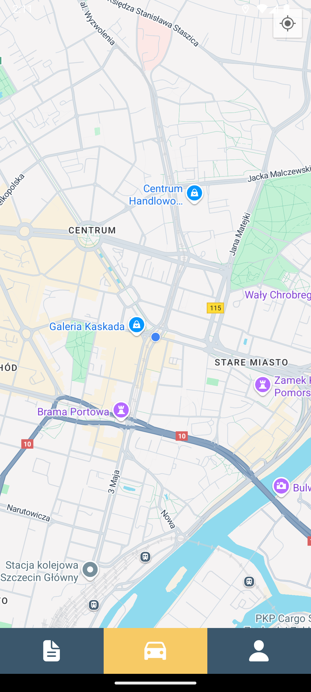
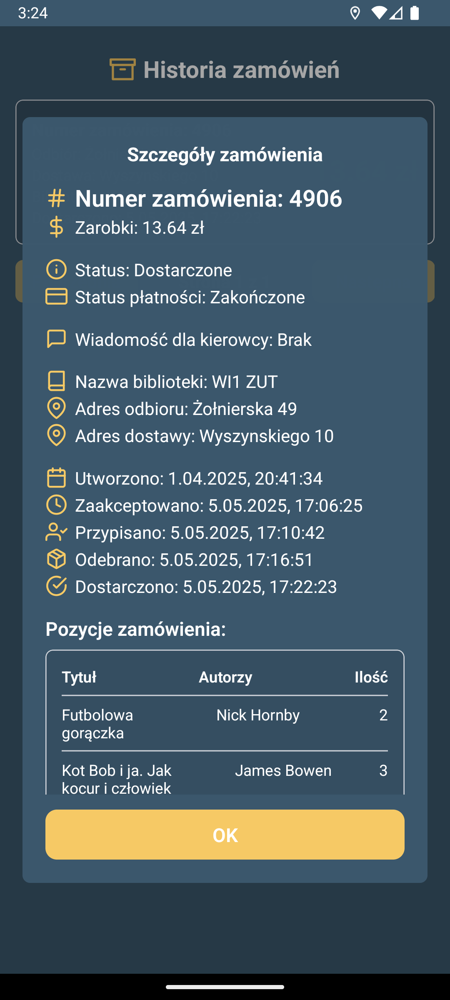
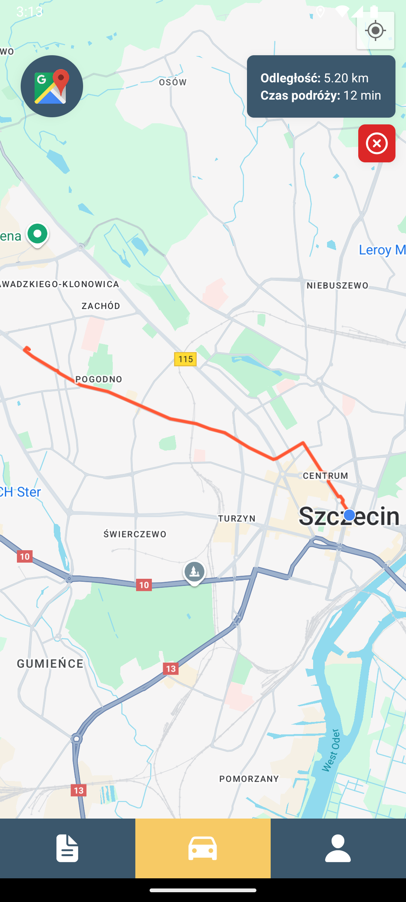
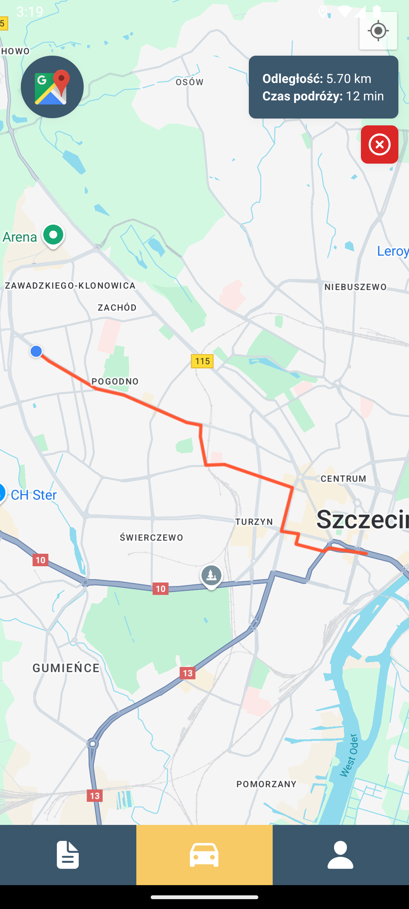
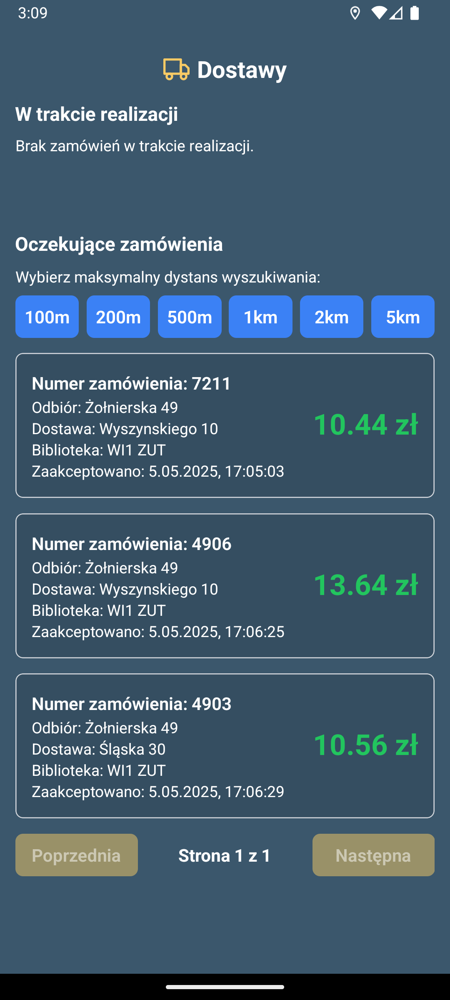
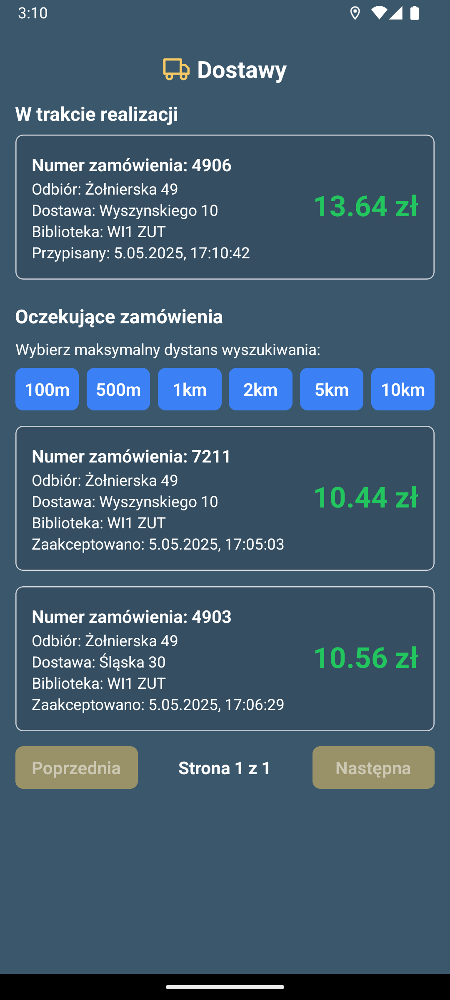
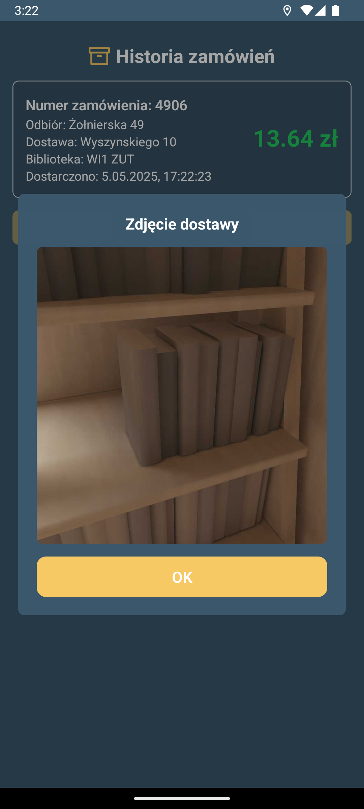
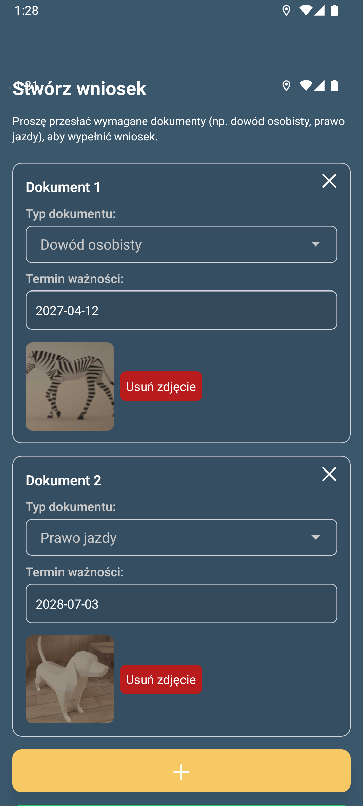

# Driver Mobile App - v1.0

## Overview  

The **Driver Mobile App** is a client application built specifically for the **system_name** backend. It provides a structured interface for drivers to interact with the system’s API, allowing them to:

- View and accept available delivery orders.
- Perform delivery actions that update order statuses.
- Access navigation to pickup and drop-off locations.
- Track completed deliveries and payments.

This application was designed to integrate with our backend, ensuring that drivers can interact with the backend through a standardized and consistent interface.

## 🔥 **Tech Stack**

- **React Native**
- **Expo**
- **NativeWind**

## 🗺️ **Google Maps Integration**  

The app includes an embedded Google Maps display for visualizing delivery routes and locations. 

Additionally, a **"Open in Google Maps"** button is provided, allowing drivers to open the delivery route in the **Google Maps app** for turn-by-turn navigation if they prefer using the external app for navigation instead of the embedded map view.  

## 📸 Screenshots

  

    
    
Main screen

  

  

    
    
Order history view

  

  

    
    
Navigation to pickup

  

  

    
    
Navigation to delivery

  

  

    
    
Pending order view

  

  

    
    
Pending order details

  

  

    
    
In realization order view

  

  

    
    
In realization order details

  

  

    
    
Show ID for librarian screen

  

  

    
    
Order details after pickup

  

  

    
    
Complete delivery screen

  

  

    
    
Delivery image display in order history

  

  

    
    
Account info screen

  

  

    
    
Create driver application view

  

  

    
    
Login screen

  

  

    
    
Register screen

  

