# User Mobile App - v1.0

## Overview

The **User Mobile App** is a client application built specifically for the **BookRider** backend. It provides a structured interface for users to interact with the system’s API, allowing them to:

- Browse our selection of books available for borrowing.
- Filter books based on various factors, like categories or libraries.
- Add selected books to their shopping cart and manage their state.
- Check prices for deliveries or returns.
- Track borrowed and returned books.
- Create in-person or with our delivery returns.

This application was designed to integrate with our backend, ensuring that users can interact with the backend through a standardized and consistent interface.

## 🛠️ **Tech Stack**

- **React Native**
- **Expo**
- **NativeWind**

## 🔄 **WebSocket Integration**

The app uses **WebSockets** to maintain a real-time connection between the server and client devices.

Refresh notifications are automatically pushed when there are updates to the **order status**, **rental return status**, or the currently active **order category** (*Pending*, *In Realization*, or *Delivered*).  
Only the visible category is refreshed, keeping the user’s current view up-to-date without needing to manually reload the app.

## 📸 Screenshots

<table>
  <tr>
    <td>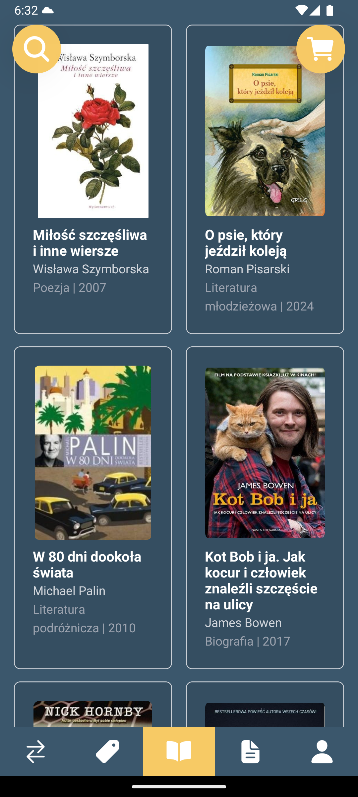</td>
    <td>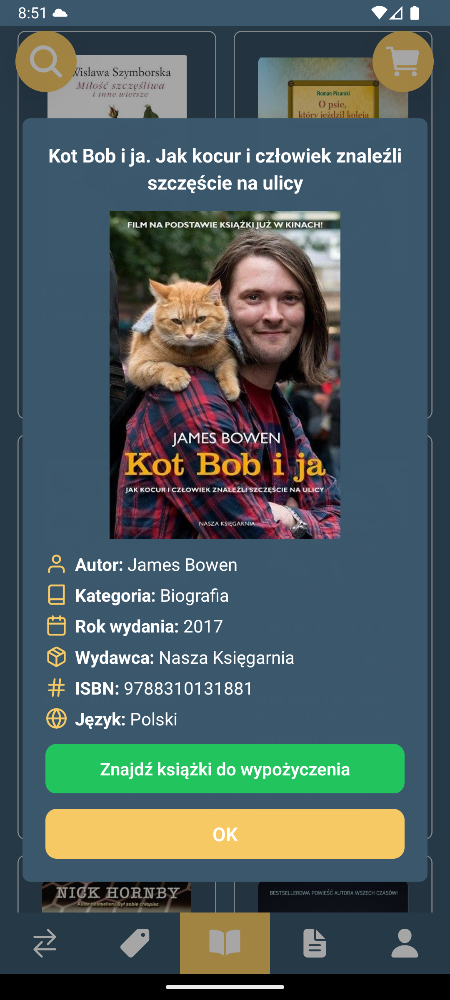</td>
  </tr>
  <tr>
    <td>Main screen</td>
    <td>Book preview</td>
  </tr>
</table>

 

<table>
  <tr>
    <td>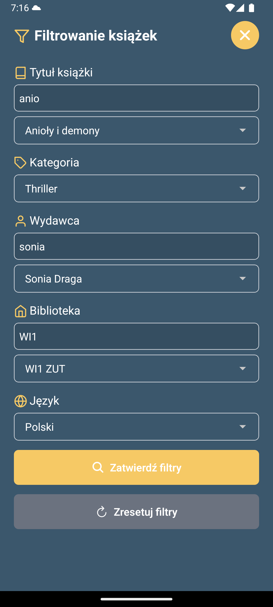</td>
    <td>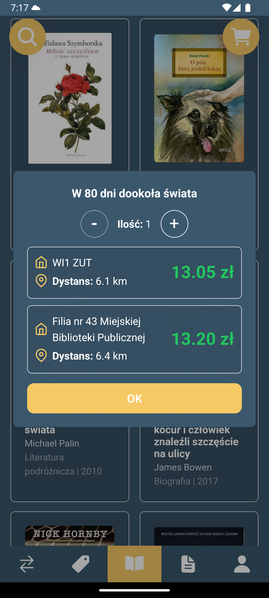</td>
  </tr>
  <tr>
    <td>Book filtering</td>
    <td>Book querying</td>
  </tr>
</table>

 

<table>
  <tr>
    <td>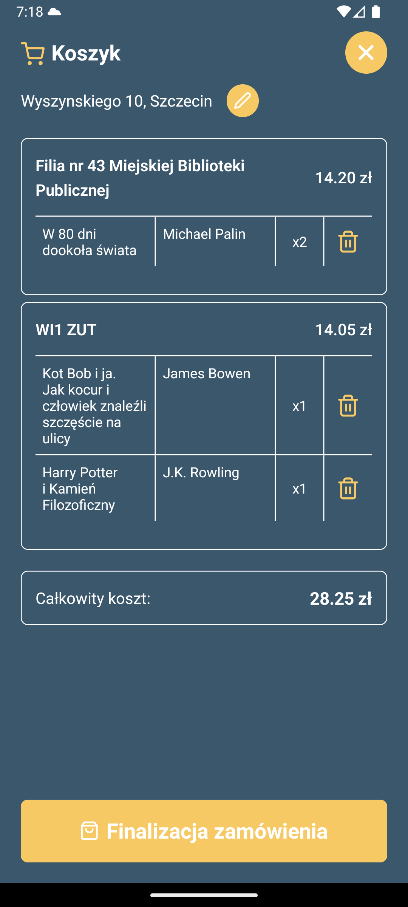</td>
    <td>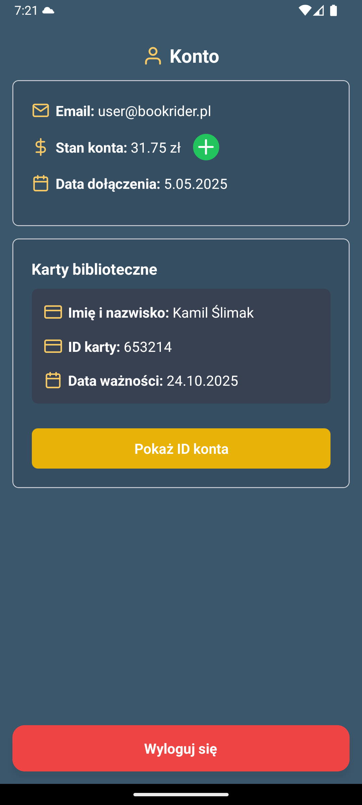</td>
  </tr>
  <tr>
    <td>Shopping cart</td>
    <td>Account details</td>
  </tr>
</table>

 

<table>
  <tr>
    <td>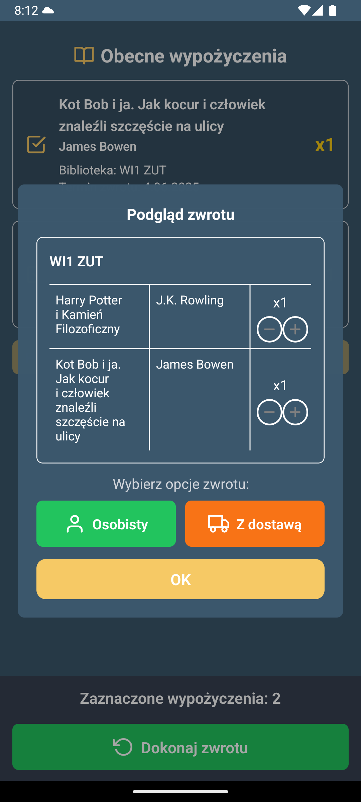</td>
    <td>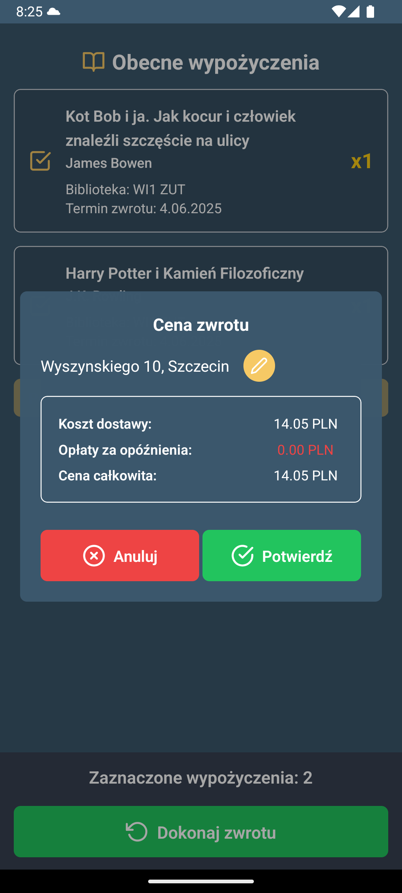</td>
  </tr>
  <tr>
    <td>Rental return preview</td>
    <td>Return confirmation preview</td>
  </tr>
</table>

 

<table>
  <tr>
    <td>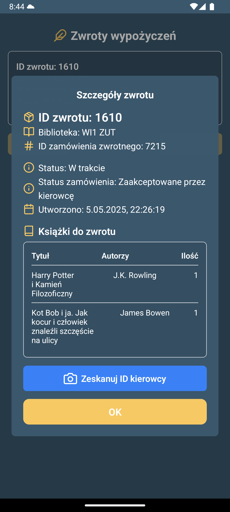</td>
    <td></td>
  </tr>
  <tr>
    <td>Rental return scan ID view</td>
    <td>Rentals view</td>
  </tr>
</table>

 

<table>
  <tr>
    <td>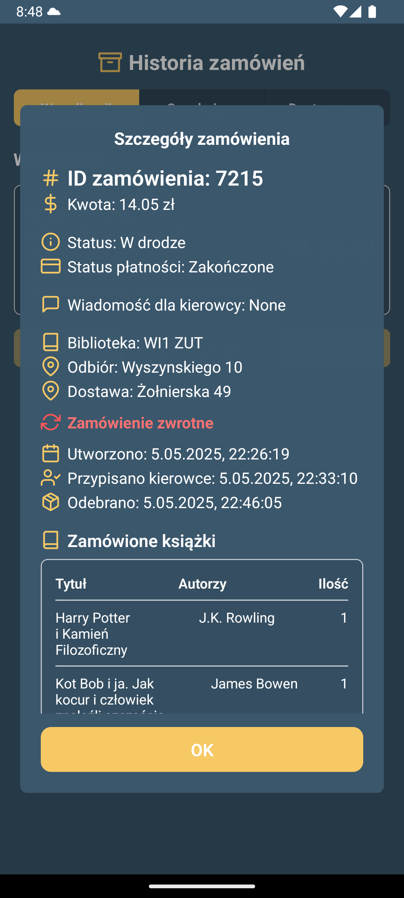</td>
    <td>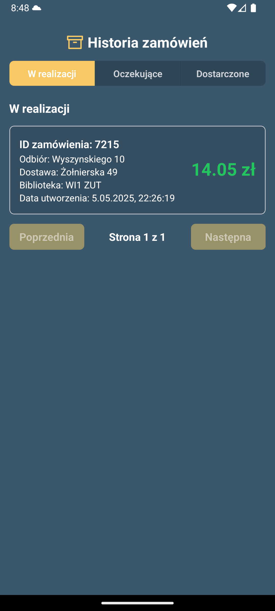</td>
  </tr>
  <tr>
    <td>Order history details</td>
    <td>Order history view</td>
  </tr>
</table>

 

<table>
  <tr>
    <td></td>
    <td></td>
  </tr>
  <tr>
    <td>Login screen</td>
    <td>Register screen</td>
  </tr>
</table>
